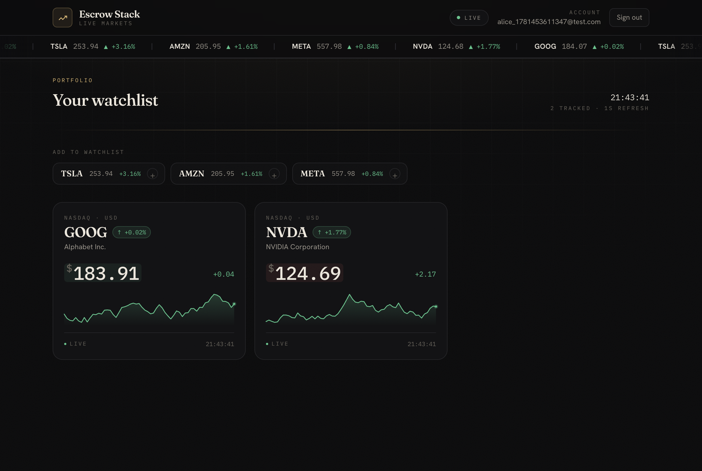
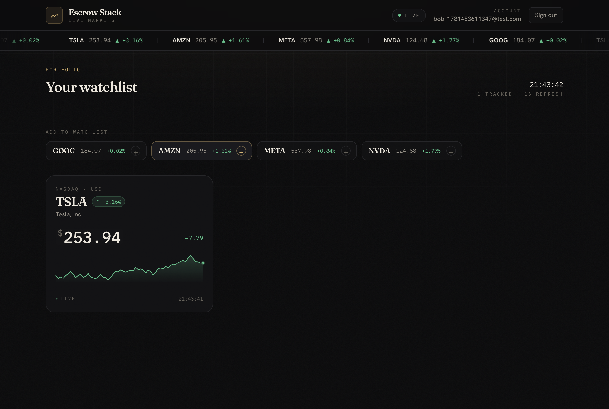

# Escrow Stack — Stock Broker Client Dashboard

A real‑time stock broker client dashboard. Users sign in with an email + password,
subscribe to supported stock tickers, and watch their prices update **live every
second over WebSockets — no page refresh**. Two (or more) users can be online at
once, each with their **own watchlist**, and every dashboard updates
**independently and asynchronously**.

Prices are produced by a server‑side random‑number generator (as the brief allows),
so there is no dependency on a real market‑data provider.

Built as a small monorepo: a **Node/Express/Socket.IO + SQLite** backend powering a
**React (Vite)** web dashboard and an **Expo / React Native** mobile app.

---

## Requirements → how it's met

| # | Requirement (from the brief) | Implementation |
|---|------------------------------|----------------|
| 0 | Login using email | Email + **password** auth (`bcrypt`‑hashed), **JWT** sessions persisted across reloads |
| 1 | Subscribe to a supported stock by ticker (5 stocks) | `GOOG, TSLA, AMZN, META, NVDA` — one‑click subscribe/unsubscribe, persisted in SQLite |
| 2 | Update prices **without refreshing** the dashboard | Live **Socket.IO** stream; each tick patches React state — the page never reloads |
| 3 | ≥2 users on different stocks, updating **asynchronously** | One central price engine broadcasts per‑ticker via Socket.IO **rooms**; each user only receives their own stocks. Proven by an automated test + a two‑browser E2E test |
| — | Random prices, updated every second | Server‑side random‑walk engine ticks every `1000 ms` (configurable) |

---

## Demo

Two users signed in at the same time, each with a different watchlist, both
streaming live:

| User A — subscribed to GOOG + NVDA | User B — subscribed to TSLA |
|---|---|
|  |  |

Notice User A's "subscribe" bar still offers TSLA/AMZN/META, while User B's offers
GOOG/AMZN/META/NVDA — the watchlists are fully independent.

---

## Architecture

```
        Web (React/Vite)              Mobile (Expo / React Native)
        ┌───────────────┐             ┌───────────────┐
        │  Dashboard A  │             │  Dashboard    │
        └──────┬────────┘             └──────┬────────┘
               │  REST: login / me / stocks  │
               │  WS:   subscribe / price …   │
               ▼                              ▼
        ┌──────────────────────────────────────────────┐
        │            Node + Express + Socket.IO         │
        │                                               │
        │   REST API ──── auth (bcrypt + JWT)           │
        │            ──── /api/me, /api/stocks          │
        │                                               │
        │   ⏱  ONE price engine                          │
        │      • random‑walks 5 prices every second     │
        │      • emits a tick per ticker                │
        │      • broadcast to room  stock:<TICKER>      │
        │                                               │
        │   💾 SQLite  (users, subscriptions)            │
        └──────────────────────────────────────────────┘
```

### The key design decision: one server‑side price engine

Prices are generated **once on the server**, never in the browser. If each client
rolled its own random numbers, two users would see *different* prices for the same
stock. Instead:

- The engine ticks once per interval and updates all five prices (a small,
  mean‑reverting random walk around the previous value, so they stay realistic).
- Each ticker is a Socket.IO **room** (`stock:GOOG`, `stock:TSLA`, …). A socket
  joins a room only for stocks that user subscribes to.
- Each tick is broadcast **only to its room**, so a user receives updates for
  *their* stocks and nothing else — independent, asynchronous dashboards, with
  everyone seeing a consistent price for any shared stock.
- Each user also joins a `user:<id>` room so multiple tabs/devices for the same
  account stay in sync when subscriptions change.
- A separate, lightweight `market` event broadcasts all five prices to every client
  each tick (the scrolling ticker tape). It's independent of the per‑subscription
  `price` stream, so it never affects the watchlist isolation above.

Subscriptions are persisted in SQLite, so on reconnect/reload the server restores
the user's rooms and sends a snapshot (current prices + sparkline history).

---

## Tech stack

| Layer | Choice | Why |
|-------|--------|-----|
| Backend | **Node.js + Express** | Matches the JD; minimal, well‑understood HTTP layer |
| Realtime | **Socket.IO** | Rooms, auto‑reconnect, and broadcast make per‑user streams trivial |
| Database | **SQLite** (`better-sqlite3`) | Real SQL, zero‑config, persists users + subscriptions, ships as a single file |
| Auth | **bcryptjs + JWT** | Hashed passwords, stateless sessions |
| Web | **React 18 + Vite + Tailwind CSS v4** | Fast dev/build, modern styling |
| Mobile | **Expo / React Native** | Matches the JD's React Native/Expo bonus; one shared backend |

---

## Project structure

```
escrow-stack/
├── server/                 # Express + Socket.IO + SQLite
│   └── src/
│       ├── index.js        # HTTP app + server bootstrap
│       ├── config.js       # env-driven config
│       ├── db.js           # SQLite schema + queries
│       ├── auth.js         # register/login routes, JWT middleware
│       ├── stocks.js       # supported stocks + central price engine
│       ├── socket.js       # Socket.IO auth, rooms, subscribe/unsubscribe
│       ├── seed.js         # creates demo users (alice/bob)
│       └── smoke.js        # automated real-time isolation test
│
├── web/                    # React + Vite web dashboard
│   └── src/
│       ├── context/AuthContext.jsx
│       ├── lib/            # api.js, socket.js, format.js, useTween.js
│       └── components/     # AuthScreen, Dashboard, StockCard, TickerTape, Sparkline, …
│
├── mobile/                 # Expo / React Native app
│   ├── App.js              # auth gate
│   └── src/                # config, api, AuthScreen, Dashboard
│
└── package.json            # root scripts (run server + web together)
```

---

## Getting started

### Prerequisites
- **Node.js 20+** (18+ works for the backend & web). For the **mobile** app, RN 0.85
  prefers Node **≥ 22.13** — older 22.x still bundles but prints an engine warning.
- npm

### 1) Install
```bash
# from the repo root — one command installs root tooling + server + web
npm run install:all
# equivalent to:
#   npm install && npm --prefix server install && npm --prefix web install
```

### 2) Run the backend + web together (one command)
```bash
# from the repo root
npm run seed                # optional: create demo users alice@demo.com / bob@demo.com (password: password)
npm run dev                 # starts API on :4000 and web on :5173
```
Then open **http://localhost:5173**.

> Prefer separate terminals?
> ```bash
> npm --prefix server start   # API + WebSocket on http://localhost:4000
> npm --prefix web run dev    # web dashboard on http://localhost:5173
> ```

### 3) See requirement #3 (two users, async updates)
1. Open **http://localhost:5173** and sign in as **alice@demo.com / password**.
2. Open a **second browser / incognito window**, sign in as **bob@demo.com / password**
   (or register any new email).
3. Subscribe Alice to `GOOG`/`NVDA` and Bob to `TSLA`.
4. Both dashboards tick **independently**, every second, with no refresh.

*(Didn't run `npm run seed`? Just click "Sign up" and register two different emails.)*

### 4) Run the mobile app (optional)
```bash
cd mobile
npm install
npx expo start              # press i (iOS sim), a (Android emulator), or scan the QR in Expo Go
```
**Networking:** a phone can't reach your computer's `localhost`. The app auto‑detects
your computer's LAN address from Expo's dev server (works in Expo Go on the same
Wi‑Fi). If needed, set `MANUAL_API_URL` in `mobile/src/config.js`. Make sure the
backend (`npm --prefix server start`) is running and reachable on port 4000.

---

## Automated tests

A self‑contained test boots the real server on a throwaway port + temp database and
asserts the hardest requirement — strict per‑user stream isolation:

```bash
npm run smoke               # from the repo root  (or: npm --prefix server run smoke)
```
It registers two users, connects two authenticated WebSocket clients, subscribes
them to different stocks, and verifies each receives **only** its own ticks (and
that unsubscribing stops the stream).

```
✓ registered two users (email + password)
✓ both WebSocket clients authenticated & connected
✓ A subscribed to GOOG, B subscribed to TSLA
✓ A received GOOG ticks only
✓ B received TSLA ticks only
✓ A never received B's stock (TSLA)
✓ B never received A's stock (GOOG)
✓ A stopped receiving ticks after unsubscribe
ALL CHECKS PASSED ✓
```

---

## API reference

### REST
| Method | Path | Auth | Body / Result |
|--------|------|------|---------------|
| `POST` | `/api/auth/register` | — | `{ email, password }` → `{ token, user }` |
| `POST` | `/api/auth/login` | — | `{ email, password }` → `{ token, user }` |
| `GET`  | `/api/me` | Bearer | `{ user, subscriptions }` |
| `GET`  | `/api/stocks` | — | catalog of the 5 stocks + latest price snapshot |
| `GET`  | `/api/health` | — | `{ ok: true }` |

### WebSocket (Socket.IO) — authenticate with `auth: { token }`
| Direction | Event | Payload |
|-----------|-------|---------|
| client → server | `subscribe` | `{ ticker }` |
| client → server | `unsubscribe` | `{ ticker }` |
| server → client | `snapshot` | `{ subscriptions, prices }` (initial load + on subscribe; includes sparkline history) |
| server → client | `subscriptions` | `string[]` (after unsubscribe) |
| server → client | `price` | `{ ticker, name, price, open, change, changePct, direction, ts }` (one per tick, per subscribed stock) |
| server → client | `market` | `[{ ticker, price, changePct, direction, … }]` — all five stocks each tick (and once on connect); powers the live ticker tape, broadcast to every client independently of their subscriptions |

---

## Configuration

Backend env (`server/.env`, see `server/.env.example`):

| Var | Default | Purpose |
|-----|---------|---------|
| `PORT` | `4000` | API/WebSocket port |
| `JWT_SECRET` | dev value | **Change for any real deployment** |
| `JWT_EXPIRES_IN` | `7d` | Session lifetime |
| `DB_PATH` | `./data/escrow.db` | SQLite file |
| `TICK_MS` | `1000` | Price update interval (ms) |
| `CORS_ORIGIN` | `*` | Allowed origin(s) |

Web env (`web/.env`): `VITE_API_URL` (default `http://localhost:4000`).

---

## Notes & decisions
- **Why a central engine** instead of per‑client randomness — so prices are
  consistent across users and the server is the single source of truth (see
  Architecture).
- **SQLite** keeps the project self‑contained (one file, no DB server) while still
  demonstrating real SQL and persistence.
- **Prices are random**, as permitted by the brief. Real data *is* available from
  free APIs — most notably **[Finnhub](https://finnhub.io/)**, whose free tier
  offers a real‑time WebSocket of US trades that would map almost 1:1 onto our
  per‑ticker Socket.IO rooms (a change contained to `server/src/stocks.js`).
  **We deliberately don't use it**, because this dashboard is meant to update
  *continuously, every second*. Real market feeds only move during US market hours
  (~9:30am–4:00pm ET, weekdays) and sit completely flat nights and weekends — which
  would make a live demo look frozen. The random‑walk engine always moves, needs no
  API key, and works offline, so it's the better fit here. (If real‑time data were
  ever needed, the swap is isolated to that one file.)
- `npm audit` reports advisories in **dev‑only** tooling (`esbuild` via Vite, and the
  Expo CLI). These are build‑time dependencies, never shipped to users; the fixes
  are major breaking upgrades, so they're intentionally not force‑applied for this
  local‑first project.
